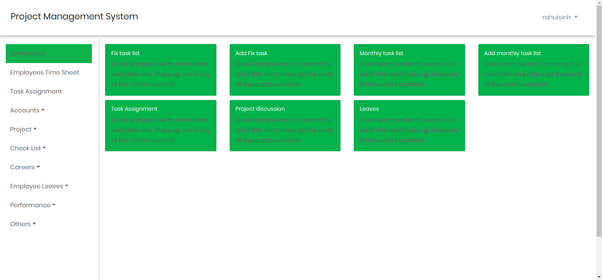
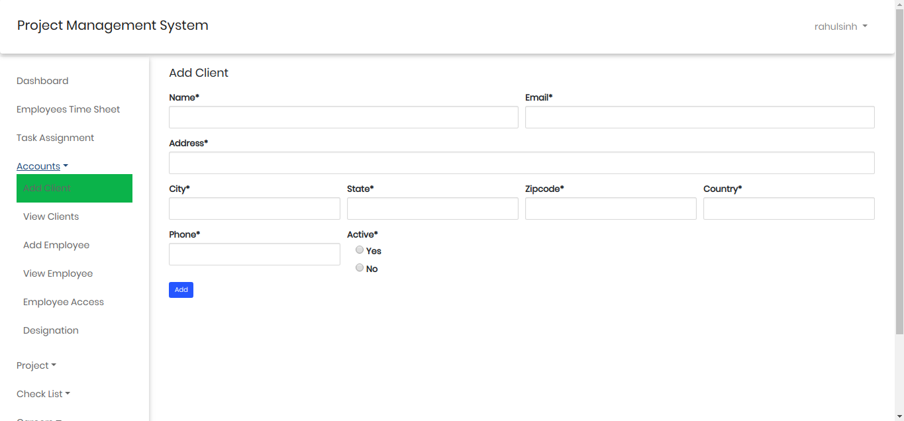
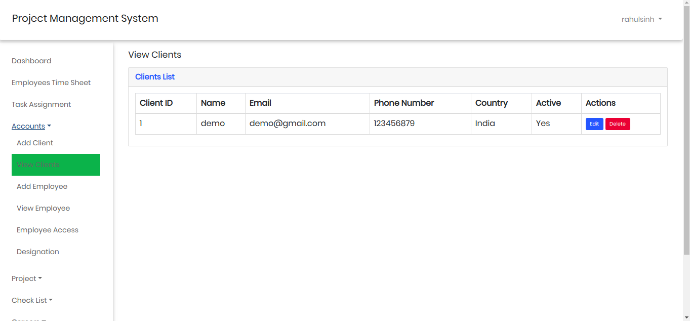
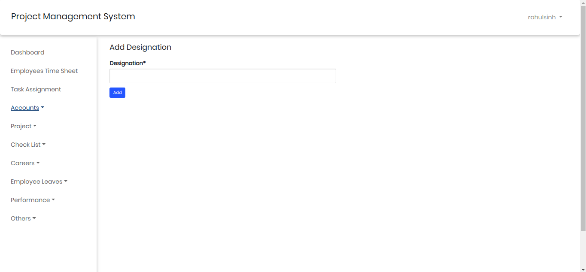
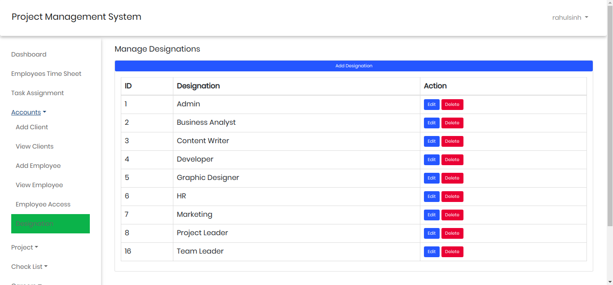
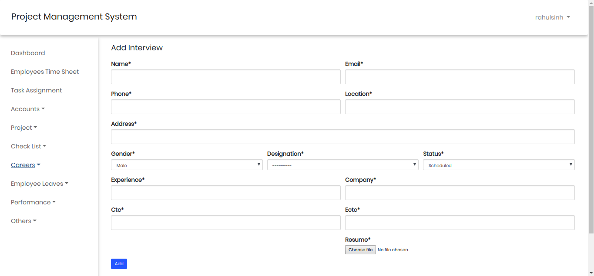
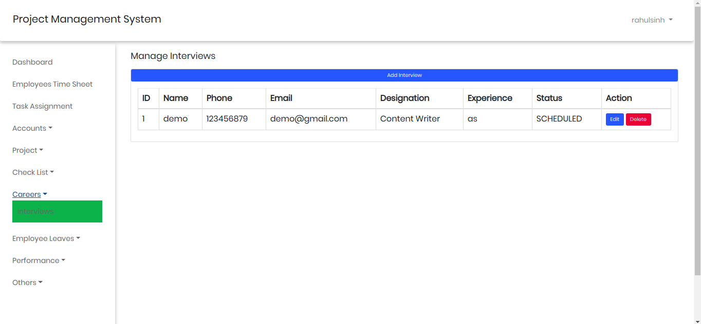
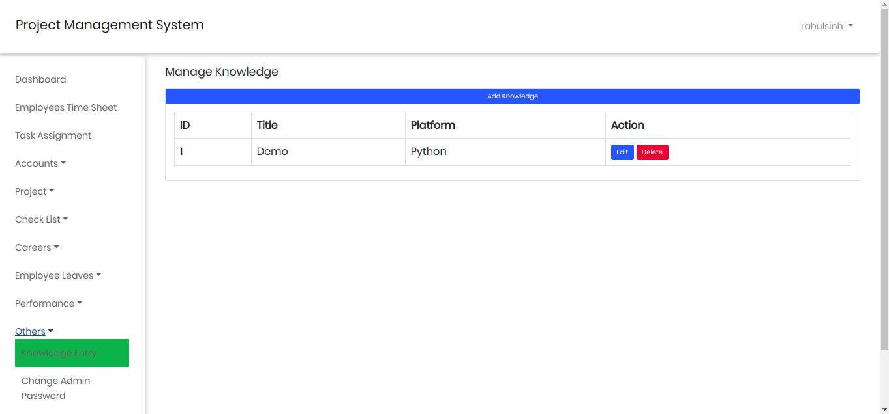
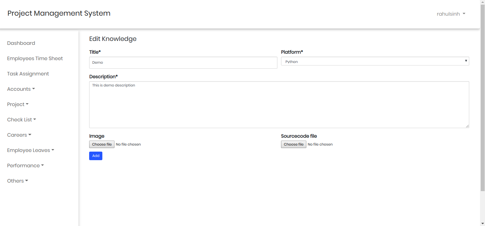

# Project Management System
Project Management System created using Django framework. It has many features like employee management, project management, clients management, project discussion, employee leaves etc. Feel free to contribute. 
This project is in initial state so please wait for an update.
New ideas are welcomed.

<h2>SCREENSHOTS</h2>

1) <h4>Dashboard</h4>
   First screen after login
   

2) <h4>Add Client</h4>
   Here person can add clients

3) <h4>View Clients</h4>
   Here person can view added clients and can perform edit and delete operations
   

4) <h4>Add Designation</h4>
   Here person can add employee designation. This designation also implies to system user
   

5) <h4>View Designations</h4>
   Here person can view added designations and can add, edit and delete the designation
   

6) <h4>Add Interviews</h4>
   Here person can add interviews to be taken and can add following details about interviewee
   

7) <h4>View Interviews</h4>
   Here person can view added interviews and can add, edit and delete the interviews and can also change it's status
   

8) <h4>View Knowledge Entries</h4>
   Here person can view added Knowledge entries. It is list of discoveries that a developer made during the development. It can be a piece of code or some kind of important steps.
   

9) <h4>Add Knowledge Entry</h4>
   Here person can add knowledge or important information and can add, edit and delete the knowledge entries
   

10) <h4>Edit Knowledge Entry</h4>
   Here person can edit existing knowledge entry
   

